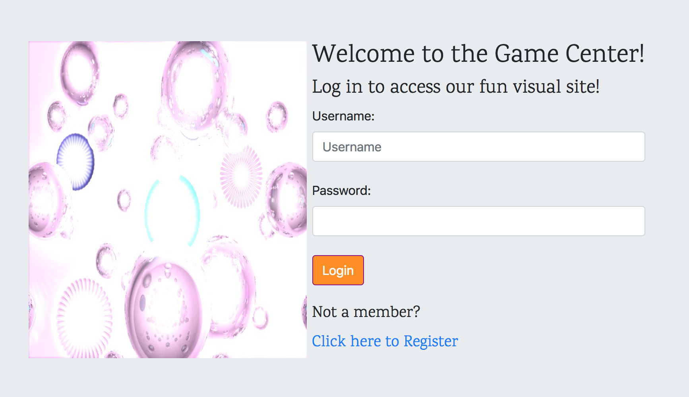
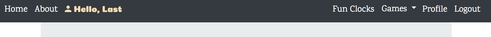
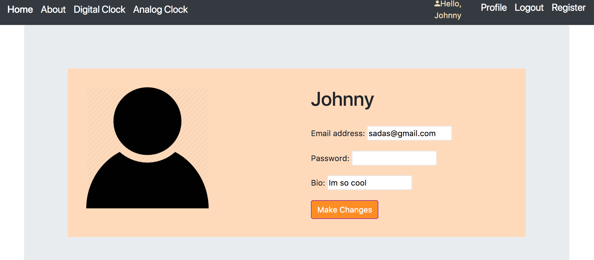

## Clock Project

A Project using Python, Django, Bootstrap, and MongoDB.

### Design

Log in or register using Django's built in form creation and log in.
The views is based on MTV architecture and allows repeated use of templates.
Once user is logged in, they can access visuals and games.

#### Navbar

This app should have a navbar on the top of every page.
On the right should allow users to log in and out.
Editable Profile for each user.
User can see a dropdown of games and can choose which game to play or
check out the clock visual.

#### Clock Design
This app should have a digital clock on the center of the page.
Button on the top should indicate either analog version of Clock
Or the digital version of the clock.

#### User Registration

Users are able to register an account. Data is stored MongoLabs which is
MongoDB . Fields include Username, Email, Password, and Bio.
After registration, users can log in and out.

#### User Profile

Users are able to click their profile and edit their email, password, or
bio and save the changes. If the user does not want to change their password,
they are not required to enter anything and can still save the other changes.

#### Games
Games will be made available in the future and is under construction!

---

#### Future Plans:
1. Make games available for this project.
2. About 3 custom games.
