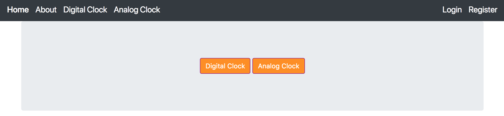

## Clock Project

Making a Project to make a clock using Python, Django, Bootstrap, and MongoDB.

### Design

#### Navbar
This app should have a navbar on the top of every page.
On the right should allow users to log in and out.
Editable Profile for each user.

#### Clock Design
This app should have a digital clock on the center of the page.
Button on the top should indicate either analog version of Clock
Or the digital version of the clock.

#### User Registration
Users are able to register an account through MongoDB. Fields include
Username, Email, Password, and Bio. After registration, users can log in
and out.

#### User Profile
Users are able to click their profile and edit their email, password, or
bio and save the changes. If the user does not want to change their password,
they are not required and can still save the other changes.

#### Games
Games will be made available in the future and is under construction!

#### Future Plans:
1. Make games available for this project.
2. About 3 custom games.
